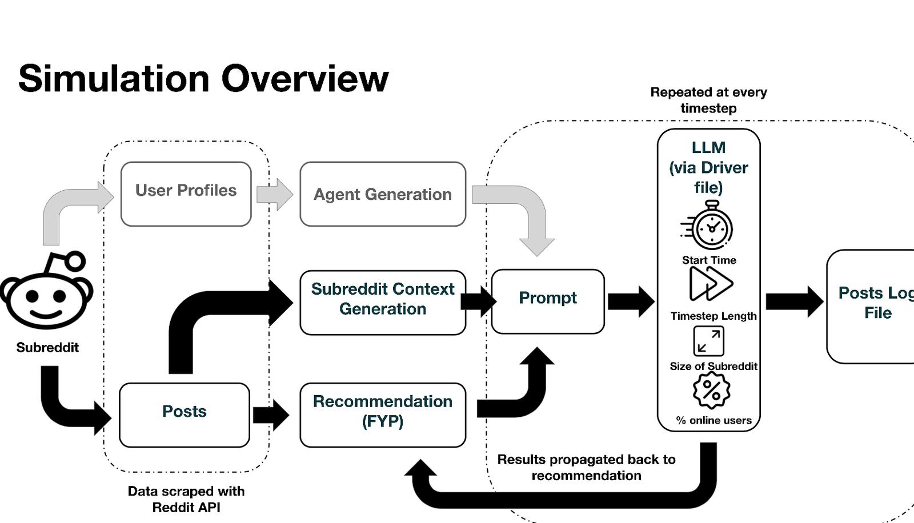

# oasis2.0

A sophisticated Reddit community simulation platform that uses local Large Language Models (LLMs) to simulate realistic user interactions and social dynamics on Reddit communities. The system generates AI agents with distinct personas, scrapes real Reddit data, and runs time-based simulations of user behavior including posting, commenting, and engagement patterns.

This simulator works with (as indicated by filename):
-  Ollama locally hosted models (driver.py)
-  Gemini API (driver2.py)
-  Openrouter models (driver3.py)

## Table of Contents

- [Project Overview](#project-overview)
- [Simulation Flow](#simulation-flow)
- [Quick Start](#quick-start)
- [Project Structure](#project-structure)
- [Prerequisites](#prerequisites)
- [Installation](#installation)
- [Environment Configuration](#environment-configuration)
- [Development Workflow](#development-workflow)
- [Running Simulations](#running-simulations)
- [Troubleshooting](#troubleshooting)


## Project Overview

Oasis2.0 simulates Reddit communities by:
- **Agent Generation**: Creating thousands of AI agents with unique personas based on real Reddit user profiles
- **Reddit Data Scraping**: Fetching real posts and user data from specified subreddits
- **Social Simulation**: Running time-stepped simulations where agents interact with posts through likes, comments, and shares
- **Recommendation Engine**: Implementing a "For You Page" algorithm that surfaces relevant content to users
- **Behavioral Analysis**: Tracking and logging user engagement patterns over time

## Simulation Flow
Here is a bird's eye view diagram of the simulation:


## Quick Start

This is a quick start tutorial on using Gemini API models.

Get up and running in 5 minutes:

```bash
# 1. Clone and setup the project
git clone <repository-url>
cd oasis2.0
pip install -r requirements.txt

# 2. Get your own Gemini API key from [Google AI studio](https://aistudio.google.com/prompts/new_chat) Then, in driver2.py, configure these settings:
...
API_KEY = os.getenv("GEMINI_API_KEY", "YOUR_API_KEY")
genai.configure(api_key=API_KEY)
MODEL_NAME = "gemini-2.5-flash" #or any gemini model
...

#3. customise your input options here:

START_TIME = datetime(2025, 7, 9, 0, 0, 0) #start time of sim
TIMESTEP_DAYS = 1 #timestep length, can configure to be in hours/mins/etc
NUM_TIMESTEPS = 10 #no of timesteps 
ONLINE_RATE = 0.0075  # ~0.75% of users online per timestep
SUBREDDIT_SIZE=43000 #no of followers in subreddit to be modelled

subreddit = "SecurityCamera" #subreddit name
POSTS_FILE = f"posts/posts.json" #posts path, all in posts directory
AGENTS_FILE = "agents/agents.json" #agents path, all in agents directory
OUTPUT_DIR = "output"
POSTS_OUT_FILE = os.path.join(OUTPUT_DIR, "posts", f"{subreddit}/posts_2.csv") #where the log file is saved 

# 4. Run your first simulation
python driver2.py
```

That's it! The simulation will start running with default settings for the SecurityCamera subreddit. Results will be saved in the `output/` directory.

💡 **First time setup tip**: The simulation uses pre-generated agents and posts. For custom subreddits, run `python posts/reddit_scraper.py` first to collect fresh data.

## Project Structure

```
oasis2.0/
├── agents/ (not used at this point)
│   ├── agent_generator.py      # Generate AI agents from user profiles
│   ├── agents_{subreddit_name}.json            # Generated agent database
│   └── scrape_users_profiles.py # Scrape user profiles from Reddit
├── posts/
│   ├── reddit_scraper.py      # Scrape Reddit posts and data
│   ├── analyse_posts.py       # Process post engagement data (not used at this point) 
│   └── posts.json            # Scraped Reddit posts
├── recommendation/
│   └── fyp.py                # "For You Page" recommendation engine
├── output/
│   ├── logs/                 # Simulation execution logs (not used)
│   └── posts/                # Post engagement results
├── prompts/                  # LLM prompt templates
├── train/                    # Training data and models
│   ├── prompt_gen.py/        # generate subreddit-specific prompt
│   └── (other files)/        # were my testing files, ignore    
├── validation/               # Validation scripts and data
├── driver.py                 # Main simulation runner
├── driver2.py               # Alternative simulation version
├── driver3.py               # Extended simulation features
├── driver4.py               # Advanced simulation configuration
```

## Prerequisites

Before setting up the project, ensure you have the following installed:


### System Requirements
- **RAM**: Minimum 8GB (16GB+ recommended for larger simulations)
- **Storage**: At least 10GB free space for models and simulation data
- **Internet Connection**: Required for initial setup and Reddit data scraping

## Installation

Follow these steps to set up the project locally:

### 1. Clone the Repository

```bash
git clone <repository-url>
cd oasis2.0
```

### 2. Create Virtual Environment

```bash
# Create virtual environment
python -m venv venv

# Activate virtual environment
# Windows:
venv\Scripts\activate
# macOS/Linux:
source venv/bin/activate
```

### 3. Install Dependencies

```bash
pip install -r requirements.txt
```

### 4. Customise your chosen LLM endpoint
For driver.py using Ollama, check the following:
```bash
# Check if Ollama is running
ollama list

# Pull required model (if not already done)
ollama pull llama3
```

For Gemini API using driver2.py,
get your own Gemini API key from [Google AI studio.](https://aistudio.google.com/prompts/new_chat) Then, in driver2.py, configure these settings:
```python
...
API_KEY = os.getenv("GEMINI_API_KEY", "YOUR_API_KEY")
genai.configure(api_key=API_KEY)
MODEL_NAME = "gemini-2.5-flash" #or any gemini model
...
```

For OpenRouter, get an API key from [the OpenRouter website.](https://openrouter.ai/)
Then, configure these settings in driver3.py:
```python
API_KEY = "YOUR_API_KEY"
MODEL_NAME = "MODEL_NAME"  # copy model name from openrouter
model="..."  # shortform name for the selected model (for file path naming)
```

## Environment Configuration


### Configuration Settings in Driver Files:

Key configuration parameters are set in the driver scripts:
```python
START_TIME = datetime(SET_TIME_HERE)
TIMESTEP_DAYS = 1 #timestep length, can configure to be in hours/mins/etc
NUM_TIMESTEPS = 10 #no of timesteps 
ONLINE_RATE = 0.0075  # ~0.75% of users online per timestep
SUBREDDIT_SIZE=43000 #no of followers in subreddit to be modelled

subreddit = "SecurityCamera" #subreddit name
POSTS_FILE = f"posts/posts.json" #posts path, all in posts directory
AGENTS_FILE = "agents/agents.json" #agents path, all in agents directory
OUTPUT_DIR = "output"
POSTS_OUT_FILE = os.path.join(OUTPUT_DIR, "posts", f"{subreddit}/posts_2.csv") #where the log file is saved 
```

### User Profiles and Agents

The system includes pre-generated user profiles:
- `agents_SecurityCamera.json` - Reddit user profiles from SecurityCamera subreddit
- `agents_NationalServiceSG.json` - Specialized profiles for National Service subreddit

### Posts

There are post datasets as part of this repo:
- `posts_SecurityCamera.json` -  dataset of 189 posts from SecurityCamera subreddit
- `posts_NationalServiceSG.json` - dataset of 227 posts for National Service subreddit

Keep building onto these existing datasets, and try the simulator on new subreddits!

Instructions to scrape data are below:

## Development Workflow

### 1. Data Collection

Before running simulations, scrape Reddit posts for your target subreddit:

```bash
python posts/reddit_scraper.py
```

Configure the following options:
```jupyter
if __name__ == "__main__":
    subreddit = SUBREDDIT_NAME
    posts = fetch_reddit_json(subreddit, limit=100)
    save_to_json(posts, subreddit)
```
Note that the Reddit API limits the number of posts that can be scraped to 100/API call; hence, the need to run the scraper program at intervals of a few days to a week to keep building the dataset!

Then, run this to get the posts with the actual engagement scores in csv format:
```bash
python validation/reddit_scraper_validation.py
```
You will be benchmarking the model results against this csv you generate.

There is also an option to scrape user profiles from a target subreddit, which will scrape the 100 user profiles with most recent activity on the subreddit. NOTE THAT THIS IS NOT NEEDED FOR THE SIMULATION AT THIS STAGE; this provides an option for further
customisation down the road.

To run this, you require a reddit PRAW (Python Reddit API Wrapper) id and secret, which
can be generated from [your app preferences.](https://www.reddit.com/prefs/apps)

Then, run: 
```bash
python agents/scrape_users_profiles.py
```

Configure the following options:
```jupyter
reddit = praw.Reddit(
    client_id="YOUR_CLIENT_ID",
    client_secret="YOUR_CLIENT_SECRET",
    user_agent="oasis2.0",
)
subreddit_name="SUBREDDIT_NAME"
```
Note that the Reddit API limits the number of profiles that can be scraped to 100/API call.


### 2. Generate AI Agents (NOTE: NOT USED IN CURRENT SIMULATION)

This is a useful addition FOR FURTHER FUTURE CUSTOMISATION.

Create AI agents based on scraped user profiles:

```bash
python agents/agent_generator.py
```

This creates a json file of the specified number of agents, with each agent given one of the scraped user profiles.

### 3. (Optional) Generate subreddit-specific prompt
You can choose a certain subsection of the posts dataset to generate a subreddit-specific context to aid the LLM in identifying viral posts correctly. 
Think of this as your "training set", i.e. these posts should not go into your simulation cycle later on.
Create a new json file for this separate training set.

Go to train/prompt_gen.py, and based on which posts actually went viral, change this:
```jupyter
Here are posts from the reddit community r/{SUBREDDIT}:

{posts_str}

Some posts (e.g. INSERT_VIRAL_POST_NUMBERS_HERE) were viral.
Based on these, identify the features that make posts go viral in this community.
```
and change the input file path at the top.

Afterward, copy the output into your selected driver file here:
```jupyter
print(recommended_posts)
    posts_str = json.dumps(recommended_posts, indent=2)
    community_details = f"""...
    
```

### 4. Run Simulation

Execute the main simulation by running either one of the 3 driver files.


### 5. Monitor Progress

Simulation progress is logged in:
- `output/posts/{subreddit}/{model}/posts.csv` - Post engagement data

### Advanced Features

- **Recommendation Engine**: Modify `recommendation/fyp.py` to adjust content recommendation algorithms.
- Currently, the recommendation algorithm is using a temporal-only approach, showing the 20 most recent posts.
- I also tried a temporal and engagement weighted algorithm, which weighs recent engagement score and age of the post; if you try to recreate this, note that
I faced an issue where the LLM would not react on some posts at all because it wasn't shown the posts!


## Troubleshooting

### Common Issues

#### 1. Ollama Connection Errors

**Problem**: `Connection refused` or `Model not found` errors

**Solutions**:
```bash
# Check if Ollama service is running
ollama serve

# Verify model is installed
ollama list

# Pull the required model
ollama pull llama3
```

#### 2. Memory Issues

**Problem**: System runs out of memory during large simulations

**Solutions**:
- Reduce `NUM_AGENTS` in `agent_generator.py`
- Decrease `NUM_TIMESTEPS` in simulation configuration
- Use a smaller LLM model (e.g., `llama3:8b` instead of larger variants)

